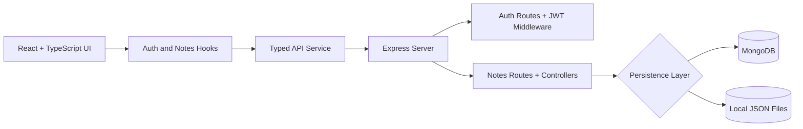

# Northstar Notes

Secure notes workspace with JWT auth, searchable note management, and a backend that falls back cleanly to local JSON storage when MongoDB is unavailable.

[](#getting-started)
[](#license)
[](#tech-stack)
[](#tech-stack)
[](#live-demo)

Hero visual: N/A for now.

## ✨ Overview

Northstar Notes is a full-stack notes application built to show production-minded frontend and backend work in one place. It is designed for users who need a clean workspace for personal notes, favorites, archive, and trash states, with secure access and fast search.

The project exists to demonstrate more than a feature checklist: it shows how the UI, API, authentication, and storage layers fit together in a maintainable way.

## 🚀 Live Demo

Live website: [Add your deployed URL here]

## 🎯 Key Features

- **Fast note organization** through all notes, favorites, archive, and trash views.
- **Secure sign-in flows** with JWT-based session handling and protected note routes.
- **Useful search and filtering** across note titles, content, and tags.
- **Real persistence behavior** with MongoDB support when available and local JSON fallback when it is not.
- **Accessible workspace interactions** including skip navigation, modal focus handling, and labeled controls.

## 🏗️ Architecture



The frontend stays thin: `App.tsx` composes lazy-loaded screens and delegates session and notes state to hooks. That keeps UI concerns separate from request orchestration and makes the app easier to reason about.

On the backend, `server.ts` mounts modular auth and notes routes, while controllers decide whether to use MongoDB or the local JSON store. That fallback approach keeps the app usable during development without forcing a database dependency, while still supporting a real database when configured.

The typed API service centralizes request formatting, token handling, and error parsing. That avoids duplicated fetch logic across the UI and keeps the frontend aligned with the server contract.

## 🛠️ Tech Stack

| Category | Technology | Why |
| --- | --- | --- |
| Frontend | React, TypeScript, Vite | Fast UI development with strong type safety and a small production bundle. |
| Styling | Tailwind CSS, Lucide React | Utility-driven styling and consistent iconography without a heavy component library. |
| Backend | Node.js, Express | Simple, predictable API layer for auth and notes operations. |
| Auth | JWT, bcryptjs | Stateless session handling with password hashing. |
| Storage | MongoDB, local JSON fallback | Lets the app run with or without a database connection. |
| Testing | Vitest, Testing Library, jsdom | Supports unit and UI behavior checks in a browser-like environment. |
| Deployment | Render, Vercel | Matches the app’s split frontend/backend deployment story. |

## 📸 Screenshots

N/A for now.

## ⚡ Getting Started

### Prerequisites

- Node.js 18+ recommended
- npm

### Install

```bash
npm install
```

### Environment variables

Create a `.env` file in the project root:

```env
PORT=3000
NODE_ENV=development
JWT_SECRET=your-super-secret-key
MONGODB_URI=
```

If `MONGODB_URI` is left empty, the app uses local JSON storage automatically.

### Run locally

```bash
npm run dev
```

### Production build

```bash
npm run build
npm run start
```

### Available scripts

```bash
npm run dev    # Start the development server
npm run build  # Build frontend and backend bundles
npm run start  # Start the production server
npm run lint   # TypeScript type-check only
npm run test   # Run the test suite
```

## 🧠 Challenges & Learnings

One of the main implementation challenges was keeping the app usable when MongoDB is not reachable. I solved that by separating persistence behind a small DB layer and falling back to local JSON data instead of letting startup fail.

Another important tradeoff was keeping the React tree thin while still supporting auth state, note filtering, and modal workflows. Moving request logic into hooks and a typed API service made the app easier to maintain and reduced the amount of state orchestration inside the top-level component.

## 🗺️ Roadmap

- Add a real deployed live demo URL.
- Add screenshots or a short GIF walkthrough.
- Expand automated tests around auth and note workflows.
- Add CI to run type-checking and tests on every pull request.

## 📄 License

No license has been added yet. If you plan to share or open-source this project, add one before publishing.
